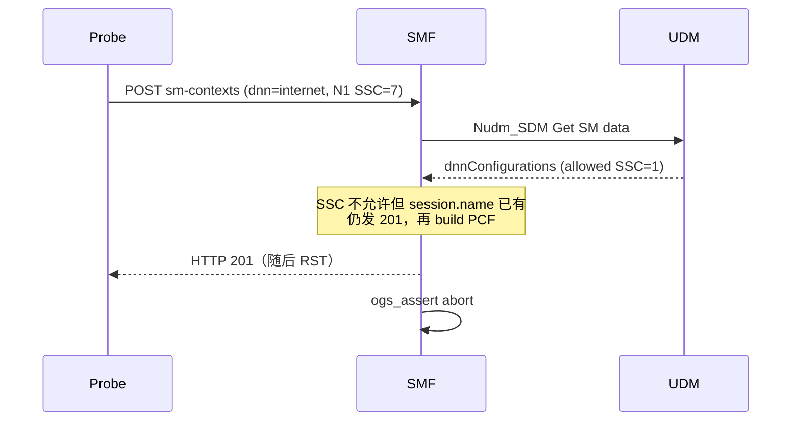

# Open5GS SMF：不允许的 SSC mode 导致断言 abort

| 字段 | 内容 |
|---|---|
| ID | `SMF-SSC-DISALLOWED-ASSERT-ABORT` |
| 状态 | **已确认**（战役触发 + 独立复现） |
| 目标 | Open5GS SMF `open5gs-smfd`（本仓库 `open5gs` **2.6.6**） |
| 接口 | N11 / `POST /nsmf-pdusession/v1/sm-contexts`（multipart JSON + 5GSM N1） |
| 类型 | 可达断言（CWE-617）→ **SMF 进程退出 / DoS** |
| 不是 | 远程代码执行、内存破坏、ProbeFuzzer Φ 确认协议违规 |
| 发现 | 结构感知接口战役 `pad_n1`，iter 38，2026-08-17 |
| 上游 | 已修： [PR #3408](https://github.com/open5gs/open5gs/pull/3408) / [commit 8b95532](https://github.com/open5gs/open5gs/commit/8b955328e7a215c361bc2c288e7b7ff9d23c1653)（2024-08）；本仓库实验栈已升到 **v2.8.0** 并复测 |

## 一句话

N1 `PDU SESSION ESTABLISHMENT REQUEST` 携带订阅不允许的 SSC mode，且 JSON 里已带 `dnn` 时，本版本 SMF **不拒绝会话**，仍回 HTTP 201，随后因 ARP 未填充导致 PCF 请求构建失败，`ogs_assert` 把整个 SMF 杀掉。

## 影响

- 一次恶意/异常 UE 5GSM 即可终止 SMF，该 SMF 上所有 PDU 会话中断，直到进程被拉起。
- 客户端看到 HTTP/2 RST（curl 92），不是规范要求的 4xx + 5GSM cause 68。
- 无证据表明可造成代码执行或会话被错误地成功建立并转发用户面。

## 触发报文

合法 5GSM（SSC mode **1**，对照）：

```
2e 05 01 c1 ff ff 91 a1
```

崩溃 5GSM（仅改最后一字节，SSC mode **7**）：

```
2e 05 01 c1 ff ff 91 a7
```

| 字节 | 含义（3GPP TS 24.501） |
|---|---|
| `2e` | Extended protocol discriminator：5GSM |
| `05` | PDU session identity = 5 |
| `01` | PTI |
| `c1` | Message type：PDU SESSION ESTABLISHMENT REQUEST |
| `ffff` | Integrity protection maximum data rate |
| `91` | PDU session type IEI=`9`，value=`1`（IPv4） |
| `a1` / `a7` | SSC mode IEI=`A`，value=`1`（合法）/ `7`（保留/不允许） |

JSON 部分必须包含 `"dnn":"internet"`（战役默认 `_sm_context_json()`）。DNN 预先写入 `sess->session.name` 是逻辑漏洞的前提。

文件：

- `poc/n1_pdu_est_ssc1.bin`
- `poc/n1_pdu_est_ssc7.bin`

## 复现

栈：Open5GS（SMF SBI `127.0.0.4:7777`），订阅 IMSI `imsi-999700000000001`，DNN `internet`，S-NSSAI SST=1。容器：`corefuzzer-wirephi`。

```bash
docker exec -i corefuzzer-wirephi python3 \
  /corefuzzer/findings/smf_ssc_disallowed_assert_abort/reproduce.py
```

已确认输出：

```
valid 201 .../sm-contexts/1
ssc7  0  curl: (92) HTTP/2 stream 1 was not closed cleanly ...
after_ssc7  SMF PIDs = []
```

日志关键字：

```
SSCMode is not allowed (../src/smf/nudm-handler.c:170)
No Arp.preempt_cap (../src/smf/npcf-build.c:157)
SBI build failed (../lib/sbi/context.c:1779)
stream has already been removed
FATAL: smf_nudm_sdm_handle_get: Assertion `r != OGS_ERROR' failed. (../src/smf/nudm-handler.c:366)
```

完整摘录见 `evidence/core.log.excerpt`。

复现会杀死 SMF。拉起：

```bash
docker exec corefuzzer-wirephi bash -lc \
  'nohup /corefuzzer_deps/open5gs/build/src/smf/open5gs-smfd \
    -c /corefuzzer_deps/open5gs/build/configs/sample.yaml \
    >> /corefuzzer/logs/core.log 2>&1 &'
```

## 根因

规范（TS 24.501 / TS 29.502）：UE 请求的 SSC mode 不在 UDM 允许列表时，SMF 应拒绝 PDU 会话，5GSM cause **68 Not supported SSC mode**（本树已有宏 `OGS_5GSM_CAUSE_NOT_SUPPORTED_SSC_MODE`），N11 回错误。本树 **没有** 循环后的 `!sess->session.ssc_mode` 拒绝。

实际路径：

1. `nsmf-handler.c:259-262`：JSON `dnn` → `sess->session.name = "internet"`。
2. `gsm-handler.c:59-61`：解析 N1 SSC IE → `sess->ue_ssc_mode = 7`。
3. `nudm-handler.c:155-172`：与 UDM `allowed_ssc_modes` 比对失败 → 打日志 `SSCMode is not allowed` → `continue`，**不拷贝 QoS/ARP**。
4. `nudm-handler.c:303-308`：成功条件只看 `sess->session.name`。名称已在步骤 1 填好，错误路径被跳过。
5. `nudm-handler.c:353-355`：向 AMF 发 **HTTP 201 Created**（stream 随后被拆除）。
6. `npcf-build.c:157-158`：ARP 未填 → `No Arp.preempt_cap` → 构建失败。
7. `sbi-path.c:113` 返回 `OGS_ERROR`；`nudm-handler.c:366` `ogs_assert(r != OGS_ERROR)` **abort**。



## 为何算真 bug、不算 Φ PV

| 判定 | 说明 |
|---|---|
| 真 bug | 可解析的 5GSM 不应杀掉控制面进程；规范要求拒绝而非 abort。 |
| 已复现 | 战役 iter 38 与手工 `…91a7` 两次 FATAL，SMF PID 消失。 |
| 上游承认同类缺陷 | PR #3408 原话：*reject instead of trying to continue processing*。`main` 在循环后增加 cause 68 + HTTP 403 `SSC_DENIED`。 |
| 不是 Φ PV | 会话没有作为合法会话继续运行；观测到的是进程死。ProbeFuzzer Φ 不以 `core.log` 为 L1 证据。 |
| 不是 RCE | `ogs_abort()`，无内存破坏迹象。 |

SSC mode 2/3 若未签约，走同一条 `ue_ssc_mode` 不匹配 → `continue` 路径（比 mode 7 更接近真实 UE 配置错误）。

## 战役出处

- 脚本：`CoreFuzzer/scripts/run_iface_campaign.py`（`IFACE_SEED=2`，`pad_n1` 对 8 字节 5GSM 单比特翻转）
- 日志：`CoreFuzzer/logs/iface_campaign_40_20260817_043702.log`
- CSV：`CoreFuzzer/iface_hits.csv` 第 38 行  
  `38,sbi,pad_n1,/sm-contexts,n1_inplace,0,0,,open5gs-smfd,,1,`
- 汇总：`CoreFuzzer/iface_campaign_results.json`（`crashes: 1`，`live_end.open5gs-smfd: []`）

## 修复对照（勿直接当本树补丁，仅说明正确行为）

上游在 `smf_nudm_sdm_handle_get` 循环之后：

- `if (!sess->session.ssc_mode)` → `gsm_build_pdu_session_establishment_reject(..., NOT_SUPPORTED_SSC_MODE)`  
- `smf_sbi_send_sm_context_create_error(..., FORBIDDEN, SSC_DENIED, ...)`  
- `return false`（**在发 201 / 调 PCF 之前**）

本树 `open5gs/lib/sbi/types.h` 已有 `OGS_SBI_APP_ERRNO_SSC_DENIED`，但 handler 未使用。

## 论文/披露口径

- **可写：** 本版本 Open5GS SMF 在不允许的 SSC mode 下因缺失拒绝路径而断言崩溃（可用性）。
- **不可写：** 确认 Φ 协议违规、RCE、适用于 Open5GS **≥2.7.5 / 2.8.0**（该路径已修）。

## 在 v2.8.0 上的复测（2026-08-17）

同一 PoC（先合法 SSC1，再 `2e0501c1ffff91a7`）：

- SSC1：HTTP **201**
- SSC7：HTTP **403** `{"cause":"SSC_DENIED"}`，进程仍在
- **不再 abort**
